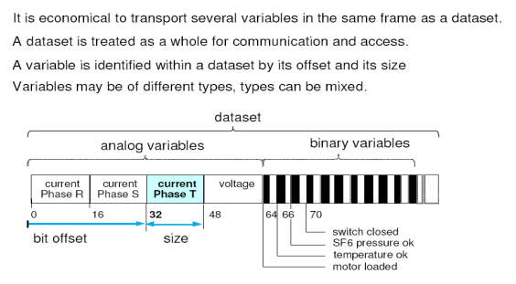
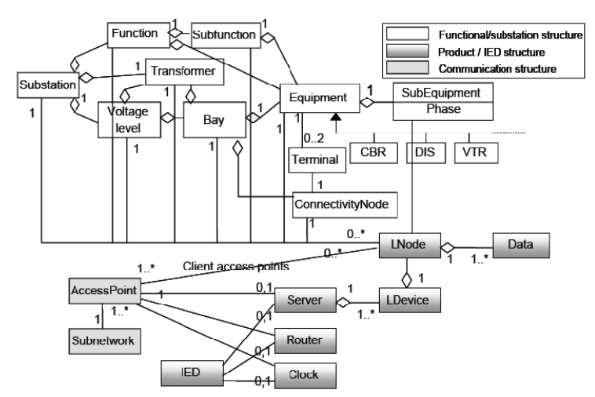
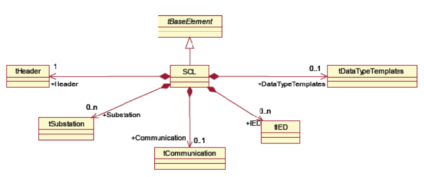
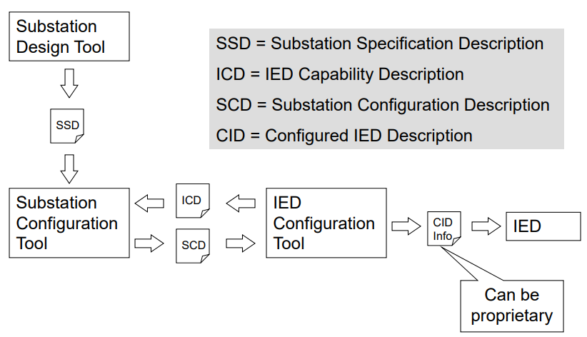
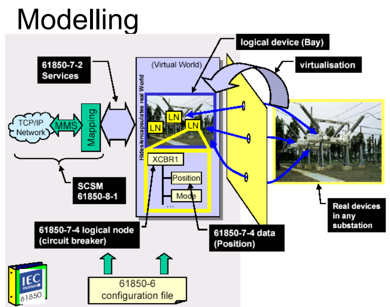
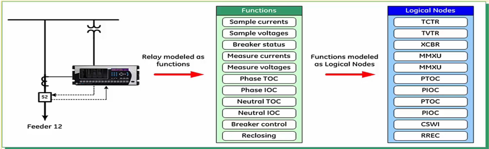
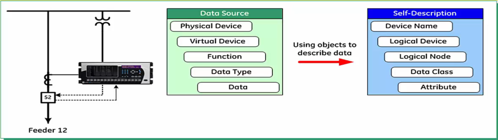

# Overview from Kalki PPT <!-- omit in toc -->

**Table of Contents**
- [1. Overview](#1-overview)
  - [Data Class](#data-class)
  - [CDCs](#cdcs)
  - [LNs](#lns)
  - [ACSI - Abstract Communication Service Interface](#acsi---abstract-communication-service-interface)
  - [Logical Nodes](#logical-nodes)
  - [Data Objects](#data-objects)
  - [Dataset](#dataset)
  - [Reporting Model](#reporting-model)
  - [Logging Model](#logging-model)
  - [GSE : GOOSE](#gse--goose)
  - [Sampled Measured Values](#sampled-measured-values)
  - [Controm Models](#controm-models)
  - [Substitution Model](#substitution-model)
  - [Setting Group Model/Control](#setting-group-modelcontrol)
  - [Substation Configuration Language](#substation-configuration-language)
- [2. Substation Configuration Language](#2-substation-configuration-language)
  - [Introduction](#introduction)
  - [The UML(Unified Modeling Language) object model of substation](#the-umlunified-modeling-language-object-model-of-substation)
  - [SCL Object Model](#scl-object-model)
    - [1.The substation model](#1the-substation-model)
    - [2.Product (IED) Model](#2product-ied-model)
    - [3.The Communication System Model](#3the-communication-system-model)
  - [Specification Method](#specification-method)
  - [The SCL syntax elements](#the-scl-syntax-elements)
  - [SCL description file types](#scl-description-file-types)
- [3. ACSI](#3-acsi)

# 1. Overview
Spec : Part 6 & 7 is important.
* Part 6 : Configuration description language for communication in electrical substations related to IEDs, `"Defines an XML Schema for ..."`
* Part 7 : Basic communication structure for substation and feeder equipment
  * Part 7-1 : Principles and models
  * Part 7-2 : ACSI
  * Part 7-3 : CDC
  * Part 7-4 : Compatible LN classes and Data classes
* Part 8 & 9 : SCSM for station & process bus
  * Part 8-1 : Mapping to MMS
  * Part 9-1 : SV over serial
  * Part 9-2 : SV over ISO/IEC 8802-3

IEC-61850 is a successor to the UCA-2

## Data Class
(defined in 7-2)
* The DATA class provides means to specify typed information contained in LNs

## CDCs
(defined in 7-3)  
* CDCs are specializations of the DATA class
* A CDC is a grouping of DA, each of a type defined as a DAType

## LNs
(defined in 7-4)  
* A LN is a grouping of DO, each of a type defined as a CDC
* A LN is an abstract model of a real device or function

## ACSI - Abstract Communication Service Interface
There is no protocol for ACSI(no ACSI PDU). So send AL PDU using SCSM.  
Client-Server based, but use Publish-Subscribe for Events, and SVs.  

Defines a set of Object Models :
* Information (Data) Models
    * Server
    * LD
    * LN
    * Data
* Information exchange Models
    * Datasets
    * Control
    * Reporting
    * Logging
    * Settings etc.

## Logical Nodes
A named grouping of data and associated services that is logically related to some power system function.

## Data Objects
* Represent data within a logical node
  * voltage, current, relay settings. etc. : 값
* Aggregate attributes of defined types
  * measurements, status, controls, configuration, etc. : 행위, 타입 의미부여
* Have independent access control
* Have standardized names, types

## Dataset
* Comprised of references to DOs, accessed with a sigle name : DO 들을 묶는다
* May be predefined or dynamic
* May be interrogated by client

## Reporting Model
* 장비들에 대한 모니터랑
* Server -> Client
* Reports members of Datasets : Dataset기준
  * By exception, triggered by data, quality changes
  * Periodic integrity report : 무기적
  * On Demand : 원할 때
* Multiple clients, Multiple Report Controls
* Various formats of reports to preserve bandwith

## Logging Model
* 서버에서 저장
* Logs memgers of Datasets
  * Same triggering as Report Model
  * Logged to circular buffer
  * Can log multiple data sets
  * Can be retrieved by multiple clients
* Retrival by entry number or timestamp

## GSE : GOOSE

## Sampled Measured Values
* A method for transmitting smapled measurements from transducers such as CTs, VTs, and digital I/O
* Enables sharing of I/O signals among IEDs
* Supports 2 tranmission methods
  * MSVC over Ethernet
  * USVC over serial links

## Controm Models
* 4 Control Models
  * Direct Control with normal security
  * SBO Control with normal security
  * Direct Control with enhanced security
  * SBO Control with enhanced security
* Enhanced Security provides validation and supervision of the control action and reporting of status

## Substitution Model
처리값 대신 Default값 전송

## Setting Group Model/Control

## Substation Configuration Language
SCL is an XML Schema defined in IEC 61850-6

# 2. Substation Configuration Language

## Introduction
* What?
  * SCL is used for the configuration of electrical substsation IEDs
* Why?
  * The interoperable exchange of communication system configuration data between an IED configuration tool and a system configuration tool
* How?
  * The configuration language is based on the Extensible Markup Language version 1.0

## The UML(Unified Modeling Language) object model of substation

## SCL Object Model
1. The primary (power) system structure
2. The communication system
3. The application level communication
4. Each IED
5. LN type definitions
6. The relations between LNs and their hosting IEDs on one side and the switchyard (function) parts on the other side

### 1.The substation model
Purpose
* to relate a LN and its function to a substation function
* to derive a functional designation for the LN from the substation structure

Substation objects
1. Substation
2. Voltage Level
3. Bay
4. Equipment
5. SubEquipment
6. ConnectivityNode
7. Terminal
8. Some process parts functions (building supervision and fire fighting systems)

### 2.Product (IED) Model
It models only the functional side of an IED.

IED objects
1. IED : a substation automation device performing SA functions by means of LNs
2. Server : a communication entity within an IED
3. LD : containerd in a server of an IED
4. LN : containerd in a LD of an IED
5. DO : the DATA containerd in the LNs

Additional IED functions
1. Router function
2. Clock function

### 3.The Communication System Model
It models the logically possible connections between IEDs across subnetworks by means of access points

Communication objects
1. Subnetwork : a connecting node for direct communication between accesspoints
2. Access point : which may be a physical port or a logical address (server) of the IED
3. Router : extends access to servers connected to another subnetwork at another access point of that IED which hosts the router function
4. Clock : to synchronize the internal clocks of all (other) IEDs connected to this subnetwork
   
## Specification Method

## The SCL syntax elements
1. Header
   1. Header
   2. History
   3. Text
2. Substation description
   1. Substation
      1. VoltageLevelName
         1. BayName
            1. Connectivity
      2. PowerTransformer
         1. Transformer Winding
3. IED description
   1. Services
   2. AccessPoint
      1. Server
         1. Logical device
            1. logical nodes
               1. Data (DO)
4. Communication System Description
   1. SubNetwork
      1. ConnectedAP
         1. Address
         2. GSE
         3. SMV
         4. Phyconn
5. Data type templates
   1. LNodeType
      1. DO
   2. DOType
      1. DA
   3. DAType
      1. BDA

## SCL description file types
ICD/SSD : need tool  
SCD/CID : same structure?

SCL file types and usage  

# 3. ACSI

