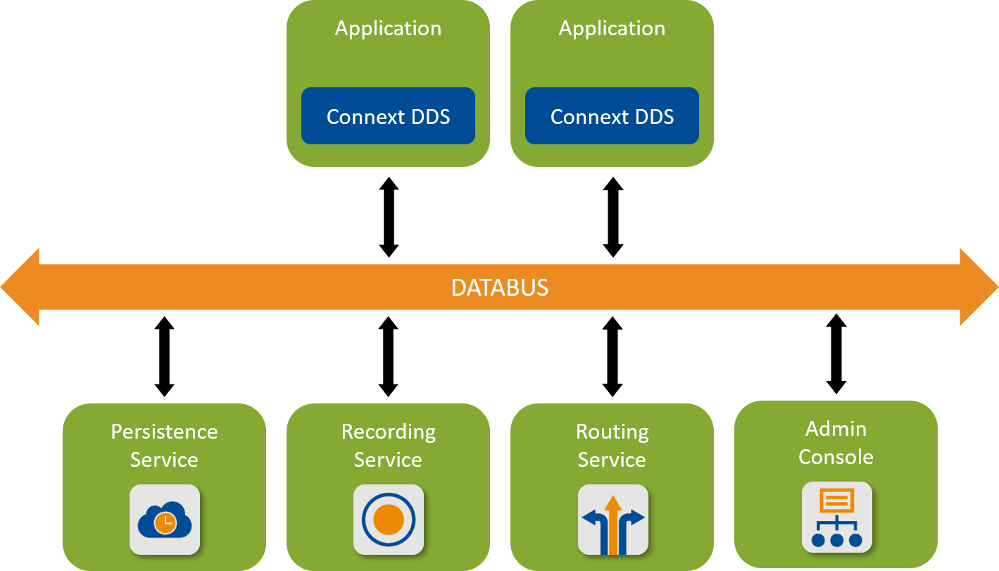

# 1. Before You Get Started <!-- omit in toc -->
[official link](https://community.rti.com/static/documentation/connext-dds/6.1.0/doc/manuals/connext_dds_professional/getting_started_guide/cpp98/before.html "https://community.rti.com/static/documentation/connext-dds/6.1.0/doc/manuals/connext_dds_professional/getting_started_guide/cpp98/before.html")

**Table of Contents**
- [1.1. What is Connext DDS?](#11-what-is-connext-dds)
- [1.3. Installing Connext DDS](#13-installing-connext-dds)
- [1.4. Setting Up a Licence](#14-setting-up-a-licence)


# 1.1. What is Connext DDS?


> RTI® Connext® DDS is a connectivity framework for building distributed applications with requirements for high performance and scalability. It includes these components:  
> * SDK that provides APIs to send and receive data.
> * Tools that help to visualize data and debug the distributed system.
> * Infrastructure Services that can perform dedicated functions in your system.

# 1.3. Installing Connext DDS
```bash
chmod +x rti_connext_dds-<version>-<package_type>-<host-platform>.run
./rti_connext_dds-<version>-<package_type>-<host-platform>.run
```

# 1.4. Setting Up a Licence
copy license file to
* <installation directory>/rti_license.dat
* <workspace directory>/rti_license.dat  

or set `RTI_LICENSE_FILE` env variable to point the license file.