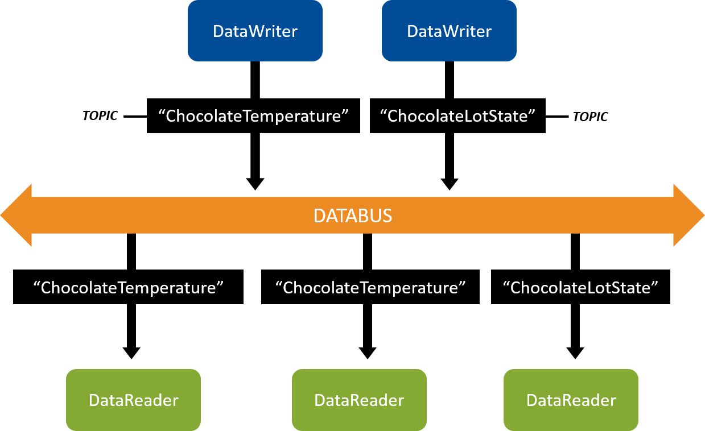
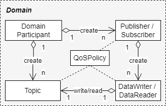

# 2. Publish/Subscribe <!-- omit in toc -->
[official link](https://community.rti.com/static/documentation/connext-dds/6.1.0/doc/manuals/connext_dds_professional/getting_started_guide/cpp98/intro_pubsub_cpp.html "https://community.rti.com/static/documentation/connext-dds/6.1.0/doc/manuals/connext_dds_professional/getting_started_guide/cpp98/intro_pubsub_cpp.html")

**Table of Contents**
- [2.1. Introduction to DataWriters, DataReaders, and Topics](#21-introduction-to-datawriters-datareaders-and-topics)
- [2.2. Hands-On 1](#22-hands-on-1)
  - [2.2.4. Open/Modify Publishing Application](#224-openmodify-publishing-application)
  - [2.2.5. Open/Modify Subscribing Application](#225-openmodify-subscribing-application)
    - [2.2.5.1. Details of Receiving Data](#2251-details-of-receiving-data)
  - [2.2.6. Compile Your Changes](#226-compile-your-changes)
  - [2.2.7. Run the Applications](#227-run-the-applications)
  - [2.2.8. Taking it Further](#228-taking-it-further)

# 2.1. Introduction to DataWriters, DataReaders, and Topics


> RTI Connext DDS Getting Started



> Zhuangwei Kang, Kyoungho An, Aniruddha Gokhale, Paul Pazandak "A Comprehensive Performance Evaluation of
Different Kubernetes CNI Plugins for Edge-based
and Containerized Publish/Subscribe Applications" in 2021 IEEE International Conference on Cloud Engineering (IC2E)

# 2.2. Hands-On 1
```bash
/home/<your user name>/rti_workspace/6.1.0/examples/getting_started
# or
git clone https://github.com/rticommunity/rticonnextdds-getting-started.git

source <installdir>/resource/scripts/rtisetenv_<architecture>.zsh
rtiddsgen -language c++ -platform <architecture> -create makefiles -create typefiles -d c++98 hello_world.idl
```
> [generated files](https://community.rti.com/static/documentation/connext-dds/6.1.0/doc/manuals/connext_dds_professional/getting_started_guide/cpp98/intro_pubsub_cpp.html#tablegeneratedcodefiles "https://community.rti.com/static/documentation/connext-dds/6.1.0/doc/manuals/connext_dds_professional/getting_started_guide/cpp98/intro_pubsub_cpp.html#tablegeneratedcodefiles")

## 2.2.4. Open/Modify Publishing Application
[official link](https://community.rti.com/static/documentation/connext-dds/6.1.0/doc/manuals/connext_dds_professional/getting_started_guide/cpp98/intro_pubsub_cpp.html#open-modify-publishing-application "https://community.rti.com/static/documentation/connext-dds/6.1.0/doc/manuals/connext_dds_professional/getting_started_guide/cpp98/intro_pubsub_cpp.html#open-modify-publishing-application")
1. Change Topic Name : HelloWorld Topic
2. Add Publishing Code

## 2.2.5. Open/Modify Subscribing Application
[official link](https://community.rti.com/static/documentation/connext-dds/6.1.0/doc/manuals/connext_dds_professional/getting_started_guide/cpp98/intro_pubsub_cpp.html#open-modify-subscribing-application "https://community.rti.com/static/documentation/connext-dds/6.1.0/doc/manuals/connext_dds_professional/getting_started_guide/cpp98/intro_pubsub_cpp.html#open-modify-subscribing-application")
1. Change Topic Name : HelloWorld Topic

### 2.2.5.1. Details of Receiving Data
[official link](https://community.rti.com/static/documentation/connext-dds/6.1.0/doc/manuals/connext_dds_professional/getting_started_guide/cpp98/intro_pubsub_cpp.html#details-of-receiving-data "https://community.rti.com/static/documentation/connext-dds/6.1.0/doc/manuals/connext_dds_professional/getting_started_guide/cpp98/intro_pubsub_cpp.html#details-of-receiving-data")  
-> DataReader being notified using WaitSet object

## 2.2.6. Compile Your Changes
reference `README_<architecture>.txt`
```bash
make -f makefile_hello_world_x64Linux4gcc7.3.0
```

## 2.2.7. Run the Applications
```bash
objs/<architecture>/hello_world_publisher
objs/<architecture>/hello_world_subscriber
```

## 2.2.8. Taking it Further
[official link](https://community.rti.com/static/documentation/connext-dds/6.1.0/doc/manuals/connext_dds_professional/getting_started_guide/cpp98/intro_pubsub_cpp.html#taking-it-further "https://community.rti.com/static/documentation/connext-dds/6.1.0/doc/manuals/connext_dds_professional/getting_started_guide/cpp98/intro_pubsub_cpp.html#taking-it-further")
