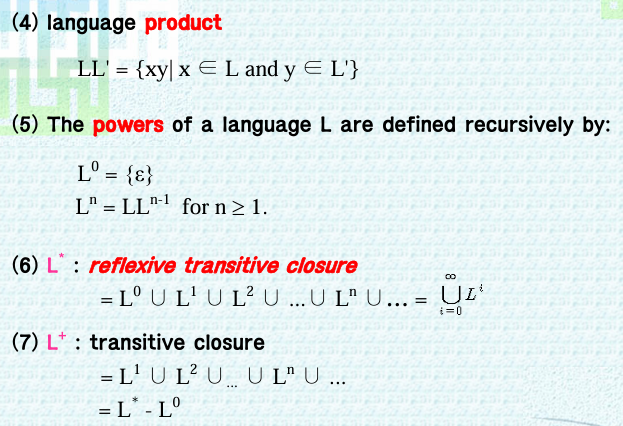

02  <!-- omit in toc -->
===

**Table of Contents**
- [1. Language](#1-language)
  - [Language Representation](#language-representation)
  - [More Definitions](#more-definitions)
- [2. Grammar](#2-grammar)
  - [Derivation](#derivation)
  - [L(G)](#lg)
  - [Language Design](#language-design)
  - [Example p.15](#example-p15)
- [3. Chomsky Hierarchy](#3-chomsky-hierarchy)


# 1. Language
1. alphabet : a finite set of symbols
2. string : a seq of symbols from alphabet
3. length : the number of symbols in the string. |ω|
4. empty string : string with no symbols. ε or λ
5. T* : the set of all strings of symbols over the alphabet T, including the empty string
   > T* : T star
   > T^+ : T dagger
   > T dagger = T star - {ε}
6. Language is any set of strings over an alphabet
   > L ⊆ T*

## Language Representation
* Set description
* Grammar
* Recognizer

## More Definitions
* concatenation
  * u • v or uv
* a^n
  * n a's
  * a^0 = ε
* reversal
  * ω^R
* language product
* powers
* reflexive transitive closure
* transitive closure
* 

# 2. Grammar
* terminal(V_T)
  * 'int'
* nonterminal(V_N)
  * TYPE_SPECIFIER
  * 의미 없음, 단지 terminal을 생성하기 위해 존재

> N -> FN LN
> FN -> '홍'
> LN -> '길동'

문법 : Terminal이 나타나는 순서를 Nonterminal을 통해 나타냄
G = (V_N, V_T, P, S)
* P : 생성규칙
  > N -> FN LN 같은거
* S : Start symbol
  > Start symbol에서 시작해서 Derivation(유도) 시작
  
## Derivation
* ⇒
* *⇒
* +⇒
> -> : production rule
> ⇒ : derivation

## L(G)
Language generated by grammar G

## Language Design
Grammer -generation-> Language
        <-design-
        
## Example p.15
* ex1)
  * L(G) = {0^n1^n | n >= 1}
* ex2)
  * L(G) = {a^ncb^n | n >= 0}
* ex3)
  * L(G) = {ab^n | n >= 1}
* ex4)
    ```
    abc

    aBbc
    abBc
    abCbcc
    aCbbcc
    aabbcc

    aaBbbcc
    aabBbcc
    aabbBcc
    aabbCbccc
    aabCbbccc
    aaCbbbccc
    aaabbbccc

    ...
    ```
    * L(G) = {a^nb^nc^n | n >= 1}

# 3. Chomsky Hierarchy
Noam Chomsky
* type 0 : No restrictions
* type 1 : Context-sensitive grammar
* type 2 : Context-free grammar
  * 문장 구조 인식
* type 3 : Regulat grammar
  * 토큰 구조 인식
> in programming, we use type 2 and 3