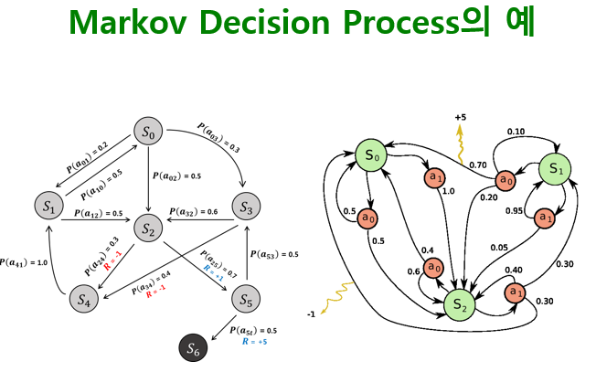
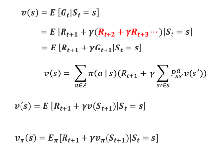

2nd  <!-- omit in toc -->
===

**Table of Contents**
- [순차적 행동의 결정문제 정형화](#순차적-행동의-결정문제-정형화)
- [MDP](#mdp)
  - [MDP의 결정 요소](#mdp의-결정-요소)
  - [상태변환확률 (state transition probability)](#상태변환확률-state-transition-probability)
  - [보상 (reward)](#보상-reward)
    - [기댓값](#기댓값)
  - [감가율 (Discounting rate)](#감가율-discounting-rate)
  - [정책 (policy)](#정책-policy)
  - [반환값 (Return value)](#반환값-return-value)
  - [가치함수 (Value function)](#가치함수-value-function)
  - [벨만기대방정식](#벨만기대방정식)
  - [Q 함수 (행동가치함수)](#q-함수-행동가치함수)
  - [최적 정책](#최적-정책)
  - [벨만 최적 방정식](#벨만-최적-방정식)

# 순차적 행동의 결정문제 정형화

> Agent, Environment, State, Action, Reward  
> 시간의 흐름 : s0, a0, r1, s1, a1, r2, ... , sT

> L : 행동A를 할 가능성, 행동A에 대한 결과는 고정. ex) 뱀사다리  
> R : 행동A를 할 가능성, 행동A에 대한 결과 또한 확률성. ex) 바둑

> Markov property : 다음 상태는 과거의 상태변화와 상관없이 오로지 현재의 상태에 의해서만 결정됨  
> s1, s2를 거쳐 st에 도달했을 때의 st+1로 갈 확률은 st에서 st+1로 갈 확률이 같다 (조건부확률?)  
> MDP : Memory-less 하다는 표현도 함

* cart-pol  
상태를 정의하는 방법에 따라 MDP가 될 수도, 혹은 non-MDP가 될 수도 있음  
> 가속도 정의 시 MDP가능

# MDP
결론적으로 MDP는 해당 문제에 따라 결정되는 것이 아니라, 해당 문제를 어떻게 표현하냐에 따라 결정 된다고 할 수 있음

## MDP의 결정 요소
순차적 행동 결정 문제를 풀기 위해 문제를 `{S, A, R, P^a_ss', y}` 튜플로 정형화하여 수학적으로 표현  
* S : State
* A : Action
* R : Reward
* P^a_ss' : 상태변환확률 (state transition probability)
* y : 감가율 (discount factor)

## 상태변환확률 (state transition probability)
s에서 a를 취했을 때 s'로 갈 확률  
> P^a_ss' = P[S_t+1=s'|S_t=s,A_t=a]

* 상태변환확률을 알고 있는 경우
  * Model Based, Dynamic Programming
* 상태변환확률을 모르는 경우
  * Model-free, Reinforcement Learning
* 상태변환확률을 학습하는 경우
  * Model Based RL

## 보상 (reward)
에이전트가 한 행동에 대한 환경의 피드백
> R^a_s = E[R_t+1|S_t=s,A_t=a]  
> R^a_s 혹은 R^a_ss' 로 표현

같은 상태s에서 같은 행동a를 했더라도 그때마다 보상이 다를 수 있음
> 기댓값(Expectation)으로 표현

보상은 현재시간 t가 아닌 t+1에 환경으로부터 받음

### 기댓값
* 표본공간(S)
    * 확률실험에서 나타날 수 있는 모든 경우의 수
* 확률변수(X)
    * 표본공간의 각 경우에 실수 값을 할당했을 때 이를 나타내는 변수
* 확률변수(X)의 기댓값E(X)
    * 확률변수 X의 확률적 평균
    > \
    > ex) 주사위의 기댓값 계산 : 

## 감가율 (Discounting rate)
미래에서 받은 보상을 현재의 시점에서 고려할 때 감가하는 비율  
보상에서 시간의 개념을 포함하는 방식
* y ∈ [0,1] : 감가율은 0에서 1사이의 값
* y^(k-1)R_(t+k) : 현재의 시간 t로 부터 k만큼 지난 후 받을 보상의 현재 가치

## 정책 (policy)
에이전트가 각 상태에서 하는 행동에 대한 정보  
상태 s에서 행동 a를 선택할 확률
> 

최적의 정책 : 각 상태에서 앞으로 받을 보상의 합(가치함수로 예측)이 가장 큰 쪽으로 상태를 변화시키도록 결정된 행동

## 반환값 (Return value)
현재 시간 t를 기준으로 에피소드가 끝날 때까지 받을 보상을 감가해서 현재가치로 변환한 보상들의 합  

* 반환값은 에피소드가 끝난 후 알 수 있으나
* 가치함수를 통해 에피소드를 진행하지 않고 현재상태에서 앞으로 받을 보상이 얼마인지 기대해 볼 수 있음

가치함수의 기초가 되는 개념 : `G1 = R2 + yG2`  

## 가치함수 (Value function)
반환값에 대한 기댓값  

* 반환값은 에이전트의 정책에 영향을 받음  
  > pi : 정책  
  > 

## 벨만기대방정식
현재 상태의 가치함수와 다음 상태의 가치함수와의 관계를 나타내는 방정식

> 현재 상태 s에 대해서 액션 a를 했을 때의 반환값의 기댓값의 합(?)

## Q 함수 (행동가치함수)
상태 s에서 행동 a를 했을 경우 예상되는 반환 값에 대한 기댓값  

## 최적 정책
최적의 가치함수를 반환하는 정책  

> max_pi : pi를 변화시켰을 때 최대가 되는 경우(값?)  
> argmax_a∈A : 최대가 될 때의 argument  
> 탐욕정책 : 단점 존재

## 벨만 최적 방정식
큐 함수가 최적일 때 가장 높은 값을 주는 행동만을 선택할 때 현재 상태의 가치함수가 최적이 됨  
