03rd  <!-- omit in toc -->
===

**Table of Contents**
- [Brief Review](#brief-review)
  - [가치함수](#가치함수)
  - [Q함수](#q함수)
  - [순차적 행동 결정 문제의 해결 과정](#순차적-행동-결정-문제의-해결-과정)
- [Dynamic Programming](#dynamic-programming)
  - [Iteration](#iteration)
    - [정책 평가](#정책-평가)
      - [반복적 정책 평가 알고리즘](#반복적-정책-평가-알고리즘)
    - [정책 발전](#정책-발전)
    - [Example](#example)
    - [가치 이터레이션](#가치-이터레이션)
  - [Iteration Overview](#iteration-overview)
- [Dynamic Programming의 한계](#dynamic-programming의-한계)

# Brief Review
## 가치함수
반환값에 대한 기댓값  
에이전트의 정책에 영향을 받음  
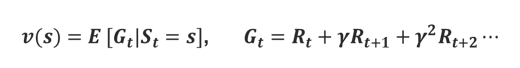
> 한 액션에 대해 상태가 고정적인지에 대한 여부에 따라 결정적 / 스토뭐시기?  
> 스토머시기에서 변환확률(P^a_ss')이 의미가 있는거일수도

## Q함수
가치함수를 행동에 따라 쪼갠 느낌

## 순차적 행동 결정 문제의 해결 과정
1. 순차적 행동 문제를 MDP로 전환
2. 가치함수에 대한 벨만 방정식 설립
3. 해를 구해 최적 가치함수 및 최적 정책을 찾음

# Dynamic Programming
환경에 대한 모델이 MDP의 형태로 완전히 주어졌을 경우 최적의 정책을 구하는 방법  
작은 문제가 큰 문제 안에 중첩돼 있는 경우 작은 문제의 답을 다른 작은 문제에서 이용  
=> 큰 문제를 작은 문제로 쪼개는 Iterative한 방법으로 해결하고자 함

## Iteration
1. 정책(policy) 이터레이션
    * 정책을 평가하고 정책을 발전시키면서 최적의 정책을 구함
        * 정책 평가(policy evaluation) : 현재 정책에 대한 가치함수를 구함
        * 정책 발전(policy improvement) : 평가된 가치함수를 기반으로 정책을 발전시킴
2. 가치(value) 이터레이션
    * 최적 정책에 대한 가치함수를 구하는 과정

### 정책 평가
S1이 벨만방정식에 의해서 S2, S3와 연관이 있다는 가정하에  
v_k+1(S1)을 구하기 위해 v_k(S2), v_k(S3)를 이용  
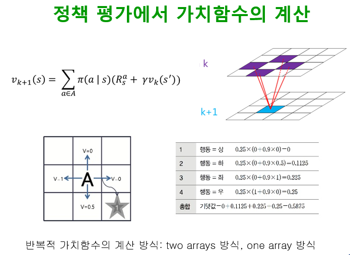

* two array : v_k, v_k+1 따로 저장
* one array : v_k/v_k+1 이 서로 혼합

#### 반복적 정책 평가 알고리즘
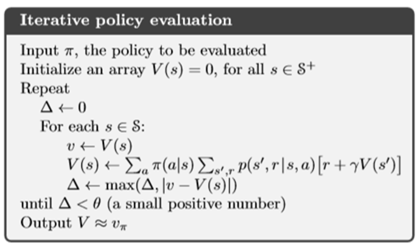

> delta : 종료시점을 결정하기 위한 변수
> theta : 종료시점 threshold
> p(s',r|s,a) : 행동에 대한 보상도 상수가 아니라 변수를 통해 확률적으로 제공

### 정책 발전
상태 s에서 변화된 행동 a를 했을 경우 기대되는 반환값을 계산  
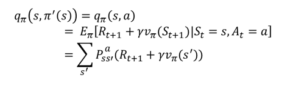

반환값이 큰 쪽으로 정책을 수정  
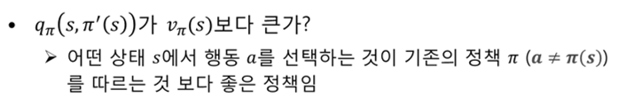  
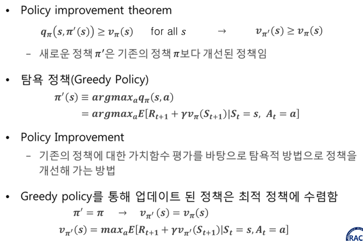

### Example
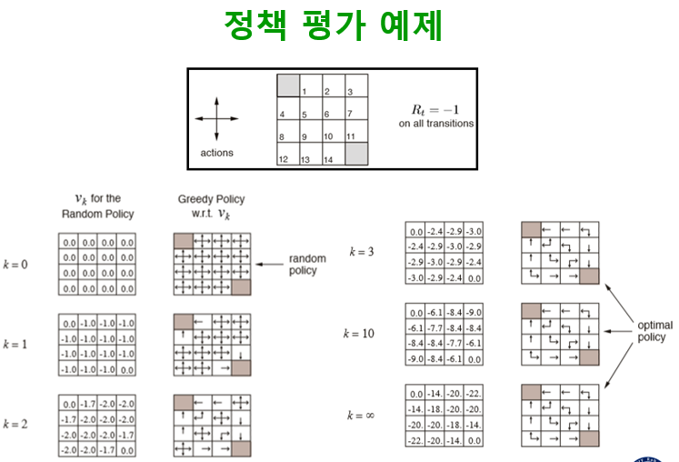\
where k = 1 and s = 1  
V_1(S_1) = 1/4 x (-1 + 0) ... = -1.0

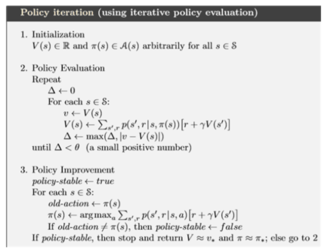

### 가치 이터레이션
정책 이터레이션을 기반으로 하지만, 탐욕 정책을 항상 사용하는 느낌  
정책을 평가하고 발전하는 두 단계의 필요가 없이, 가치함수를 평가(할 때 탐욕정책을 사용)하는 것 만으로 최적가치함수 계산  
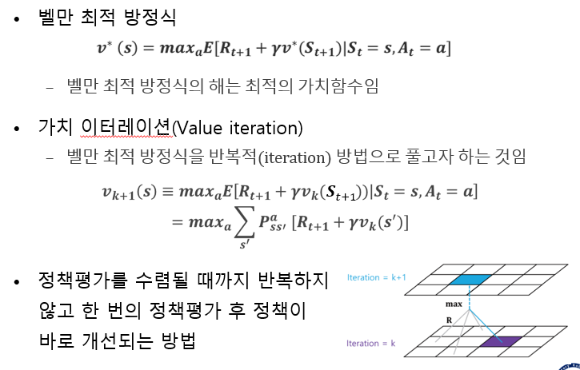  
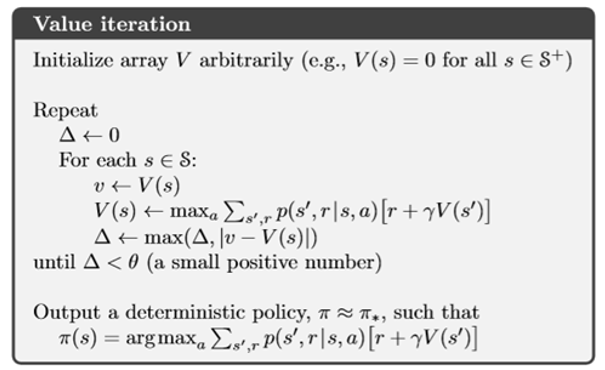

## Iteration Overview
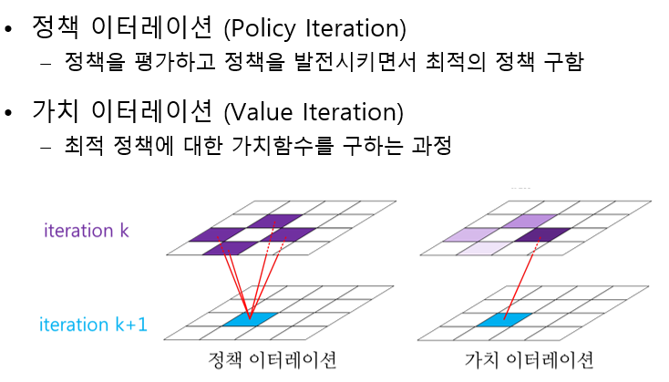

# Dynamic Programming의 한계
1. 계산 복잡도
   * 상태크기의 3제곱
2. 차원의 저주
   * 상태의 차원이 늘어나면 상태의 수가 지수적으로 증가
3. 환경에 대한 완벽한 정보가 필요
   * 해당 정보를 정확히 알 수 없는 경우가 일반적