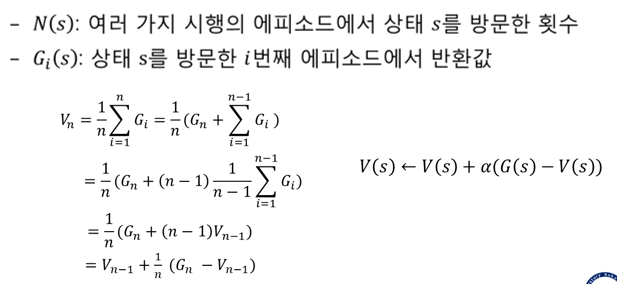

04  <!-- omit in toc -->
===

**Table of Contents**
- [Prev](#prev)
- [몬테카를로 근사의 개념](#몬테카를로-근사의-개념)
- [가치함수의 몬테카를로 예측](#가치함수의-몬테카를로-예측)
  - [First visit vs Every visit](#first-visit-vs-every-visit)
  - [Ass3 example](#ass3-example)
- [몬테카를로 예측을 통한 정책선택](#몬테카를로-예측을-통한-정책선택)
  - [Exploring Starts](#exploring-starts)


# Prev
MDP : 환경모델을 알고있는 경우  
강화학습 : 환경모델에 대해 모르는 경우

# 몬테카를로 근사의 개념
> 환경모델을 모르니까 일단 박자


# 가치함수의 몬테카를로 예측



alpha : 학습 weight. 상수값으로 쓰는 것이 일반적

## First visit vs Every visit
First visit MC method : 하나의 에피소드에서 s에 최초로 방문한 이후 한번만  
Every visit MC method : 하나의 에피소드에서 s에 최초로 방문한 이후 모두

## Ass3 example
```
episode : S0 a01 0 S1 a12 1 S2 a25 0 S5 a57 -1 S7 a79 2 S9

use V(s) = V(s) + a(G(s) - V(s))

G(s7) = 2
G(s5) = -1 + 0.9*2 = 0.8
G(s2) = 0 + 0.9*0.8 = 0.72
G(s1) = 1 + 0.9*0.72 = 1.648
G(s0) = 0 + 0.9*1.648 = 1.482

set a = 0.1

V(s0) = 0 + 0.1(1.482 - 0)
```

# 몬테카를로 예측을 통한 정책선택
환경모델을 모르는 경우 state-action pair에 대한 action value q_pi(s, a)를 예측할 필요가 있음  
deterministic vs stochastic

## Exploring Starts
탐색을 시작하는 지점을 지정해서 탐색