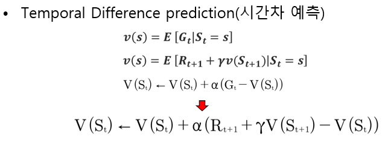
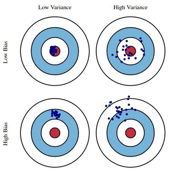
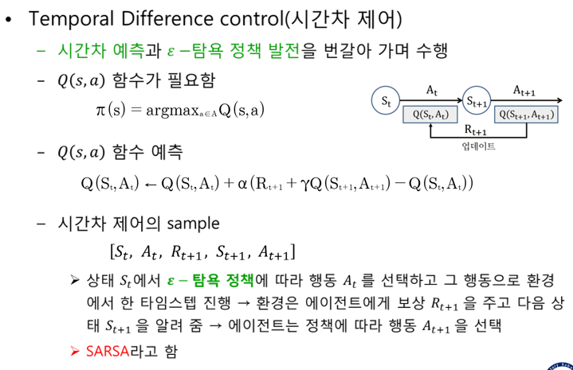

05  <!-- omit in toc -->
===

**Table of Contents**
- 

# Review
벨만방정식  
DP  
MC  

# Temporal Difference Learning
vs MCP : MCP는 episode가 종료할 때 까지 진행  
TDP는 episode가 아니라 time step 단위로 가치함수를 업데이트
> `G`가 `R + yV(S')`가 되었다는 것은 termination까지 가서 G를 계산하지 않고 각 step마다 R + yV(S')를 계산할 수 있다는 것

v(s) : 정확한 값  
V(S) : 추정치  

* MC의 sampling 개념과 DP의 bootstrapping 개념을 혼합
  * MC sampling: 환경에 대한 모델 없이 경험으로부터 학습
  * DP의 bootstrapping: 최종적인 결과를 기다리지 않고 이미 학습된 다른 상태의 가치함수 예측값을 부분적으로 이용해 현재 상태의 가치함수를 예측(추정)

## Bias & Variance

MC : Variance가 클 가능성이 큼
TD : Bias가 클 가능성이 큼 (V(S')의 영향을 받음?)

## Temporal Difference Control

* SALSA : on-policy
* Q-learning : off-policy