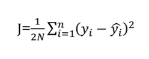

06  <!-- omit in toc -->
===

**Table of Contents**
- 

# 
v hat : v의 근사 ish

weight = 파라미터 벡터 (w, omega, theat 등) ish

목적 함수 (가치함수, cost function ?)  

손실 함수 : 하나의 데이터 단위에서 내가 추정한게 실제 데이터와 얼마나 다른지  
> (yi - yhati)