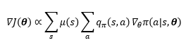

08  <!-- omit in toc -->
===

**Table of Contents**
- 
- 

#
1주 : 이론 마무리  
2주 : 실습  
기말 : 텀프  
DeepQN 방식으로 Cartpool 예제 있음  
Pendulum 으로 바꿔서 DeepQN 이나 PGM 같은걸로 만들기

#
 
S상태에 도달할 상대적 빈도수
S에서 할 수 있는 행동
그거에 대한 리턴
의 미분?