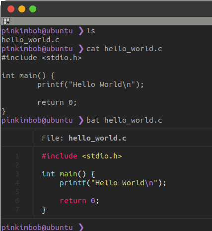
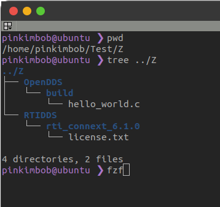
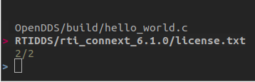
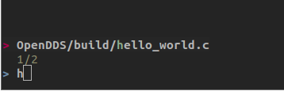
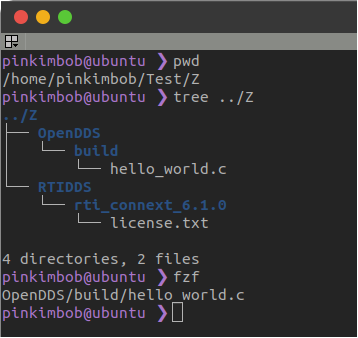
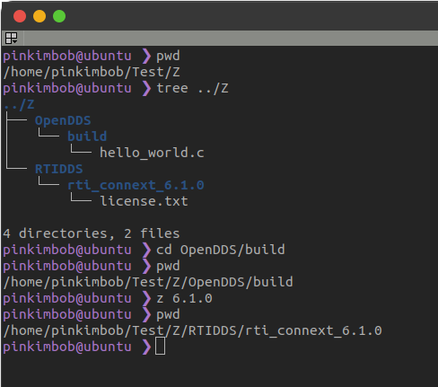

Terminal  <!-- omit in toc -->
===

**Table of Contents**
- [References](#references)
  - [Zsh](#zsh)
- [TheFuck](#thefuck)
- [Bat](#bat)
- [FZF](#fzf)
- [Z](#z)

# References
https://safjan.com/top-popular-zsh-plugins-on-github-2023/

## Zsh
[Installation Reference](https://github.com/ohmyzsh/ohmyzsh/wiki/Installing-ZSH#install-and-set-up-zsh-as-default "https://github.com/ohmyzsh/ohmyzsh/wiki/Installing-ZSH#install-and-set-up-zsh-as-default")
```bash
sudo apt install zsh
chsh -s $(which zsh)
```

# TheFuck
> fix command  
> 명령어 실수 정정

https://github.com/nvbn/thefuck  
https://github.com/nvbn/thefuck/issues/650    


# Bat
> cat  
> 예쁜 파일 출력 

https://github.com/sharkdp/bat  
https://github.com/sharkdp/bat?tab=readme-ov-file#on-ubuntu-using-apt



# FZF
> file finder  
> 빠른 파일명 검색

https://github.com/junegunn/fzf/blob/master/README-VIM.md


<br />

<br />

<br />


# Z
> jump arround  
> 폴더 이동 기록 기반 쉬운 폴더 이동  
> 폴더명 일부를 쓰면 가장 최근 혹은 가장 많이 이동한 폴더를 자동으로 찾아서 이동

https://github.com/rupa/z  
https://github.com/agkozak/zsh-z?tab=readme-ov-file#for-oh-my-zsh-users

